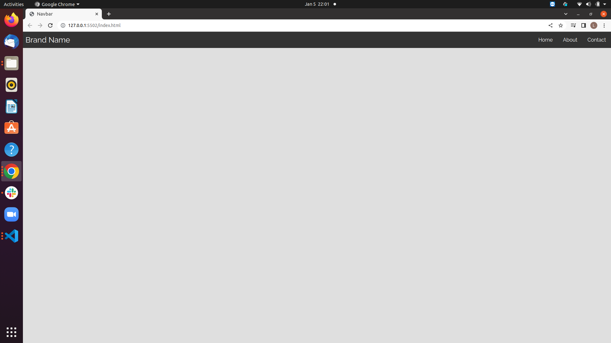
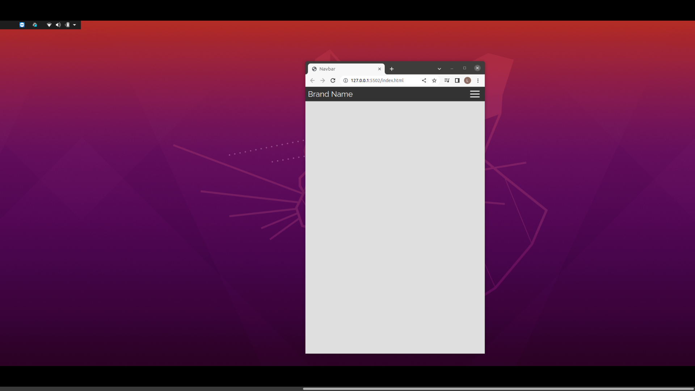

## Your App name

**[Test this app yourself](github.io)**

---

### About Project

Responsive Navbar menu

##### Developed With

- [x] _HTML5_
- [x] _CSS3_
- [ ] _SASS_
- [x] _SCSS_
- [x] _JavaScript_
- [ ] _React_
- [ ] _Bootstrap_
- [ ] _npm_
- [ ] _..._

---

### Contact

Mail: <you@mail.com> 
GitHub: [yourGHName](https://github.com/) 
LinkedIn: [your linkedIn](#)

---

### Used Tools
- [Google Fonts](https://fonts.google.com/)
- [Visual Studio Code](https://code.visualstudio.com/)
- [ColorZilla](https://www.colorzilla.com/chrome/)

---

Made with ❤️ by me
